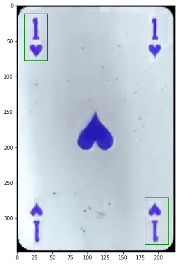
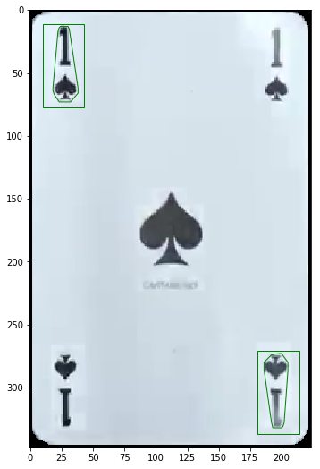
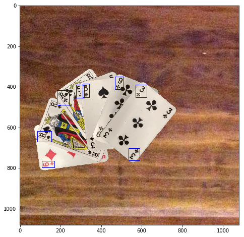

# CardsCVML

Computer Vision generative Dataset and Machine learning on playing cards

This project is using
  - python 3.6.7 and several libraries
  - opencv
  - CV libraries
  - imgaug
  
For full project go to **DatasetCreator.ipynb**

## Quick resume
#### 1: extract cards from videos 

#### 2 : Get top and bottom corner

#### 3 : affine selection by convexing select

#### 4 : generate scenes with bbox's

## Generated data example

  
 
## Train cards with YOLOv3 OR/AND Tensorflow and the generated datasets
### A. use Tensorflow on google colab
## B. Run the train and export  frozen model.pb with tf
## C. result with tf
here are the result at step 170k

