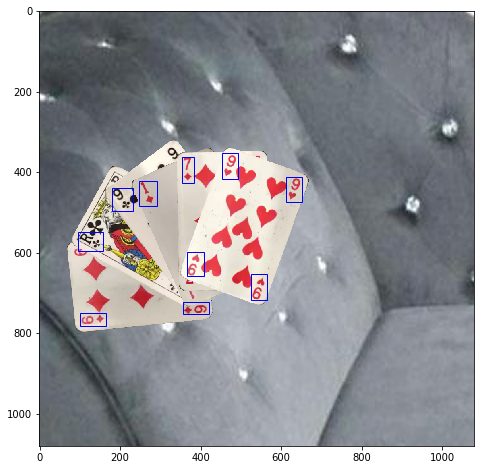

# CardsCVML

Computer Vision generative Dataset and Machine learning on playing cards

This project is using
  - python 3.6.7 and several libraries
  - opencv
  - CV libraries
  - imgaug
  
For full project go to **DatasetCreator.ipynb**

## Quick resume
#### 1: extract cards from videos 

#### 2 : Get top and bottom corner

#### 3 : affine selection by convexing select

#### 4 : generate scenes with bbox's

## Generated data example

  
 
## Train cards with Tensorflow and the generated datasets
CNNs are regularized versions of multilayer perceptrons. Multilayer perceptrons usually mean fully connected networks, that is, each neuron in one layer is connected to all neurons in the next layer. The "fully-connectedness" of these networks makes them prone to overfitting data. 

CNNs take advantage of the hierarchical pattern in data and assemble more complex patterns using smaller and simpler patterns. Therefore, on the scale of connectedness and complexity, CNNs are on the lower extreme.

The hidden layers are mostly convolutional layers : 
+ Input is a tensor with shape (number of images) x (image width) x (image height) x (image depth).
+ Convolutional kernels whose width and height are hyper-parameters, and whose depth must be equal to that of the image
+ Convolutional networks may include local or global pooling layers to streamline the underlying computation. Pooling layers reduce the dimensions of the data by combining the outputs of neuron clusters at one layer into a single neuron in the next layer
+ Activation layers :  **ReLu layers**  that removes negative values from an activation map by setting them to zero and maight be some **Pooling layers**

### A. Used algorithm : Faster R-CNN Inception V2

In an R-CNN algorithm, we feed the input image to the CNN to generate a convolutional feature map

### B. use Tensorflow on google colab

## C. Run the train and export  frozen model.pb with tf

## C. result with tf
here are the result at step 170k

